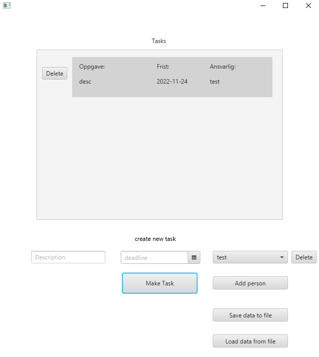
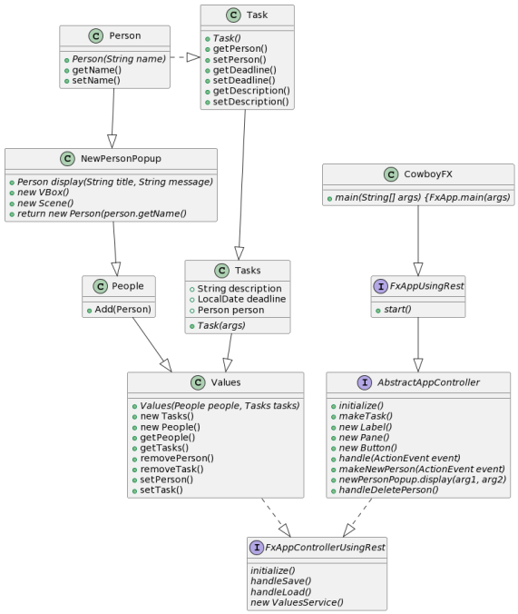

### Programmets oppførsel

Programmet har funksjonalitet til å oprette personer, også oprette arbeidsoppgaver som har frist og beskrivelse, også utdele arbeidsoppgaven til en av personene. Denne dataen skal lagres slik at om appen lukkes vil dataen bli lagret, og når appen åpnes igjen vil den lese dataen fra fil. Den har og mulighet for å slette nåværende valgte Person, og Taskene.

## Arkitektur

Vi har en oppstartsklasse (**FxApp.java**), som avhengig av dens interne verdi server, vil enten bruke kontrolleren FxAppController, eller FxAppControllerUsingRest. Begge to utvider den abstrakte plassen AbstractAppController, og utvides med hver sin type fillagring. FxAppController vil bruke lokal fil til fillagring, mens FxAppControllerUsingRest vil bruke en server. Serveren er kjørt for tiden på [localhost.3000](localhost:3000), men kan alltids endres i restapi-modulen. Man må da endre noe av FxAppControllerUsingRest også. NewPersonPopUp klassen er en hjelperklasse for AbstractAppController, og brukes til å åpne et nytt vindu hvor man legger inn feltene til et nytt Person-objekt.

## Klassediagram

Siden FXUI implementerer alle de andre modulene, er det mest oversiktlig å ha klassediagrammet her, da klassediagrammet bare viser hvordan de ulike klassene interagerer med hverandre, uten å ta hensikt i hvilken pakke eller modul de er fra.

