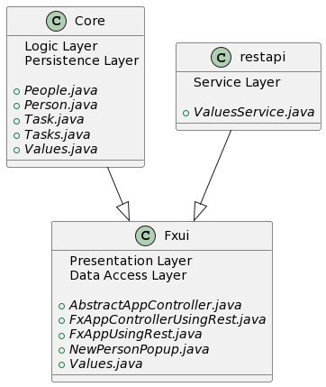

# CleaneFX

Prosjektet er delt inn i modulene [core](core/README.md), et lager for domene og lokal persistens, [fxui](fxui/README.md), et lager for alt brukergrensesnitt og klassene som bygger det, og en [restapi](restapi/README.md) modul, som styrer lagring til og fra server. Prosjektet inneholder tester av alle modulene med relativt grei testdekningsgrad.

Vi bruker Jackson hovedsaklig for persistens, javafx for brukergrensesnitt, og [json-server](https://github.com/typicode/json-server) for restapi. Vi valgte Jackson for json-parsing da den er svært populær med god dokumentasjon, javafx fordi alle på gruppen hadde erfaring med det, og json-server ettersom det fylte alle behovene vi hadde uten å være unødvendig komplisert.

## Bygging med maven
I rot-mappen (der du er nå), ligger parent **pom.xml**'filen som har oversikt over alle submodulene og felles konfigurasjon (som maven plugin-versjoner og plugin-executions). Vi har noen felles avhengigheter og noen plugins i parent pom'en. Når du først skal aksessere prosjektet burde du kjøre mvn clean install fra denne mappen for å få alle modulene og plugins som trengs.

## Kjøring av EXE'er
Vi har også lagt til 2 EXE-filer. Funksjonaliteten er lik, men "CleanE Local Executable" bruker bare direkte fillagring til fil, mens CleanE with Server Executable bruker en jsonserver for å hente/lagre informasjon.

Om du vil kjøre CleanE with Server Executable må du ha installert json-server, noe som er veldig fort gjort [her](https://github.com/typicode/json-server). Du trenger NPM som følger med når man installerer [nodejs](https://nodejs.org/en/download/) for å kunne installere json-server.  Når du har lastet ned og skal starte serveren, kan du bruke en tom JSon-fil som argument, eller bruke data.json i mappen fxui. Den vil da starte en server, og CleanE with Server Executable vil automatisk koble seg opp mot denne.

EXE'ene ble først kompilert til .jar filer med [maven assembly plugin](https://maven.apache.org/plugins/maven-assembly-plugin/), deretter brukte vi [Launch4j](https://launch4j.sourceforge.net/) til å gjøre de om til exe.

Mac-brukere må kjøre **mvn clean install** fra denne mappen (Parent), deretter **cd fxui**, og til slutt **mvn javafx:run**, for å åpne programmet. Default kontrolleren er den som implementerer server, og kan endres til den som bruker lokal lagring ved å gå inn på [fxuiApp](fxui/src/main/java/fxui/FxApp.java), og endre **boolean server** til **false**.

## Oppsett

Dette bildet viser hvordan de ulike pakkene interagerer og er avhengige av hverandre, i form av et pakke-diagram. Langt mer beskrivende klassediagram og sekvensdiagram finnes henholdsvis i [fxui](fxui/src/main/java/fxui) og [restapi](restapi/src/main/java/cleane/restapi).

